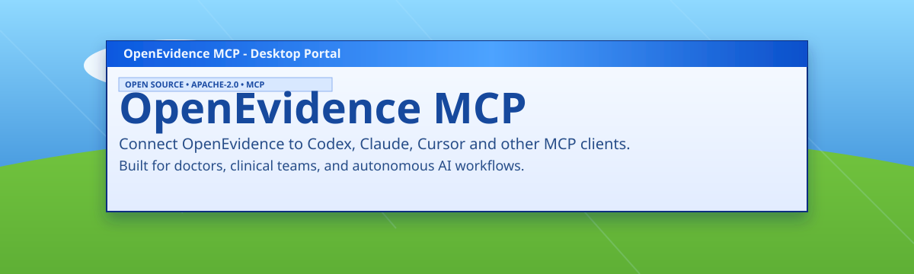

<p align="center">
  
</p>

<h1 align="center">OpenEvidence MCP - AI Agent Install Playbook</h1>

<p align="center">
  Runbook for Codex, Claude Code, and similar agents to install and validate OpenEvidence MCP end-to-end.
</p>

<p align="center">
  <a href="README.md">Human Guide</a> •
  <a href="https://bakhtiersizhaev.github.io/openevidence-mcp/">Live Docs</a> •
  <a href="docs/SEMANTIC_CORE.md">Semantic Core</a>
</p>

## Goal

Install and validate OpenEvidence MCP on macOS, Windows, or Ubuntu, with clear handoff for human login.

For a user-facing copy/paste prompt, use `docs/AGENT_INSTALL_PROMPT.md`.

## Scope

- Agent checks runtime and MCP availability
- Agent installs missing dependencies
- Agent sets up OpenEvidence MCP
- Human performs OpenEvidence login
- Agent verifies MCP tools are live

## Step 0: Detect Environment

- OS: macOS, Windows, Ubuntu/Linux
- Host client:
  - Codex CLI
  - Claude Desktop / Claude Code
  - Other MCP client

## Step 1: Ensure Playwright MCP Exists

If Playwright MCP is missing, install/configure first.

### Codex config (`~/.codex/config.toml`)

```toml
[mcp_servers.playwright]
command = "npx"
args = ["-y", "@playwright/mcp"]
startup_timeout_sec = 60
```

### Claude Desktop config (`claude_desktop_config.json`)

```json
{
  "mcpServers": {
    "playwright": {
      "command": "npx",
      "args": ["-y", "@playwright/mcp"]
    }
  }
}
```

After config change:
- restart MCP client session/app if tools do not appear immediately

## Step 2: Install OpenEvidence MCP Repo

### macOS

```bash
cd /path/where/repo/should/live
git clone https://github.com/bakhtiersizhaev/openevidence-mcp.git openevidence-mcp
cd openevidence-mcp
./scripts/setup-macos.sh
```

### Ubuntu/Linux

```bash
cd /path/where/repo/should/live
git clone https://github.com/bakhtiersizhaev/openevidence-mcp.git openevidence-mcp
cd openevidence-mcp
./scripts/setup-ubuntu.sh
```

### Windows (PowerShell)

```powershell
cd C:\path\where\repo\should\live
git clone https://github.com/bakhtiersizhaev/openevidence-mcp.git openevidence-mcp
cd openevidence-mcp
.\scripts\setup-windows.ps1
```

## Step 3: Register OpenEvidence MCP

### Codex (`~/.codex/config.toml`)

```toml
[mcp_servers.openevidence]
command = "node"
args = ["/ABSOLUTE/PATH/openevidence-mcp/dist/server.js"]
startup_timeout_sec = 60
```

Windows path example:

```toml
[mcp_servers.openevidence]
command = "node"
args = ["C:\\Users\\<user>\\openevidence-mcp\\dist\\server.js"]
startup_timeout_sec = 60
```

### Claude Desktop

```json
{
  "mcpServers": {
    "openevidence": {
      "command": "node",
      "args": ["/ABSOLUTE/PATH/openevidence-mcp/dist/server.js"]
    }
  }
}
```

After config change:
- restart client session/app if MCP list does not refresh automatically

## Step 4: Human Login Handoff

Ask user to run:

```bash
cd /ABSOLUTE/PATH/openevidence-mcp
npm run login
```

Human actions:
- complete OpenEvidence login in browser
- return to terminal
- press Enter

If Google sign-in reports "This browser or app may not be secure", stop the Playwright login flow and run:

```bash
cd /ABSOLUTE/PATH/openevidence-mcp
npm run login:browser
```

This launches system Chrome/Edge with a local profile, waits for the human to complete login, then captures and verifies local session state. Do not suggest stealth/evasion flags or any access-control bypass.

Alternative import flow:

```bash
cd /ABSOLUTE/PATH/openevidence-mcp
npm run login -- --import /path/to/storage-state.json
```

## Step 5: Validate

Run:

```bash
cd /ABSOLUTE/PATH/openevidence-mcp
npm test
npm run build
npm run check
npm run smoke
```

Then MCP-side checks:
- `oe_auth_status`
- `oe_history_list`
- `oe_article_get` when an article ID is available
- `oe_ask` with `wait_for_completion=false` for long questions
- `oe_article_wait` with the returned `article_id`

Agent workflow notes:
- Use `oe_auth_status` before other tools when auth state is unknown.
- Use `original_article_id` only for true follow-up continuity; omit it for fresh questions.
- Treat OpenEvidence output as evidence-research context, not medical advice, diagnosis, or clinical orders.
- Never expose cookies, storage-state files, tokens, account identifiers, screenshots with private data, or patient-identifiable information.

## Step 6: Recovery Paths

- If `oe_auth_status` is unauthenticated: rerun `npm run login`
- If MCP tool not visible: restart client session/app
- If dependencies break: rerun setup script

## Clean Repository Rules for Agents

- Do not commit user session files
- Do not commit `.env` with secrets
- Keep `.gitignore` intact
- Keep reusable examples in `examples/`
- Preserve parser files in `docs/`
- Preserve attribution: keep `LICENSE` and `NOTICE`
